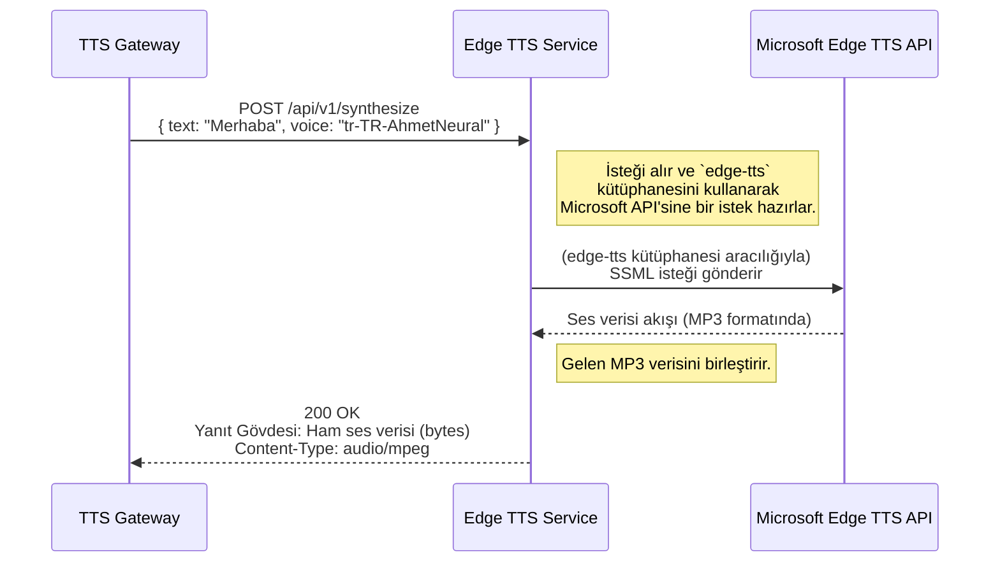

# ⚡ Sentiric Edge TTS Service - Mantık ve Akış Mimarisi

**Belge Amacı:** Bu doküman, `tts-edge-service`'in Sentiric platformu içindeki **"Hızlı ve Ücretsiz Uzman Ses Motoru"** rolünü, temel çalışma prensiplerini ve `tts-gateway` ile olan basit etkileşimini açıklar.

---

## 1. Stratejik Rol: "Varsayılan Ses Üretim İş Atı"

Bu servis, platformun varsayılan, genel amaçlı ve maliyetsiz ses üretme motorudur. `tts-gateway`, ses klonlama gibi özel bir yetenek gerektirmeyen tüm standart sentezleme isteklerini bu servise yönlendirir.

**Bu servis sayesinde platform:**
1.  **Maliyet-Etkin Olur:** Microsoft Edge'in bulut tabanlı TTS motorunu kullandığı için, Google veya ElevenLabs gibi ücretli API'lere olan bağımlılığı azaltır ve operasyonel maliyetleri düşürür.
2.  **Hızlı Olur:** `edge-tts` kütüphanesi, yüksek kaliteli sesi çok düşük gecikmeyle üretebilir, bu da canlı diyalog akışkanlığı için kritiktir.
3.  **Çok Dilli ve Çok Sesli Olur:** Microsoft'un sunduğu geniş ses kütüphanesine (`tr-TR-AhmetNeural`, `en-US-JennyNeural` vb.) erişim sağlayarak platforma ses çeşitliliği katar.

---

## 2. Uçtan Uca İstek Akışı

`tts-gateway`'den gelen bir isteğin bu servis tarafından nasıl işlendiği aşağıda gösterilmiştir:

